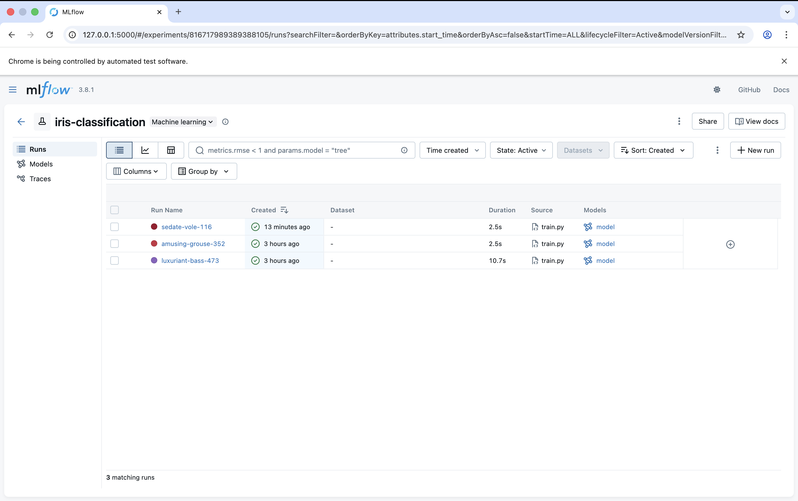
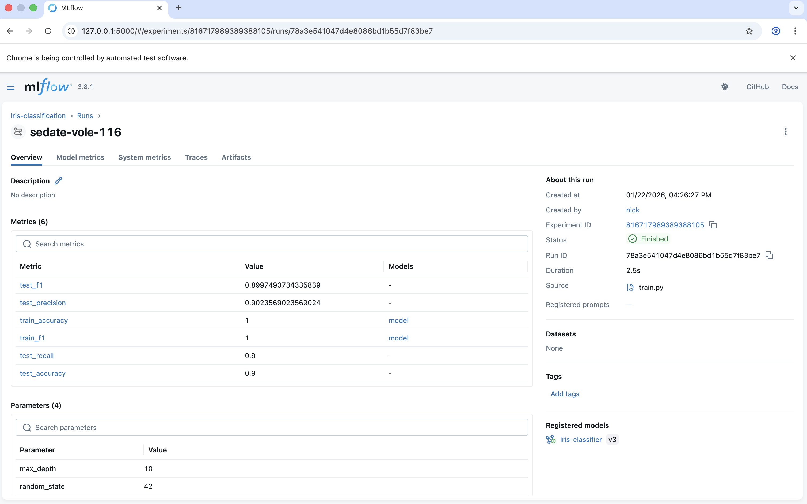
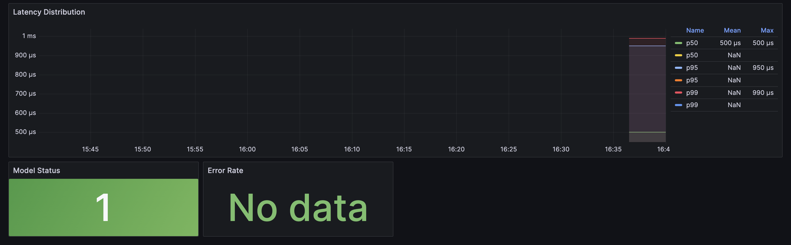

# MLOps Pipeline - Iris Classification

MLOps-контур для ML-сервиса классификации Iris.

## Структура

```
├── dvc.yaml                 # DVC pipeline
├── src/
│   ├── prepare.py           # Data preparation
│   ├── train.py             # Training + MLflow
│   ├── evaluate.py          # Evaluation
│   └── service.py           # FastAPI service
├── feast/                   # Feature Store
├── airflow/dags/            # Retraining DAG
├── infra/                   # Terraform IaC
├── prometheus/              # Monitoring config
├── grafana/                 # Dashboards
└── .github/workflows/       # CI/CD
```

## Запуск

### Обучение модели

```bash
source .venv/bin/activate
dvc repro
```

### ML-сервис

```bash
uvicorn src.service:app --port 8000
```

API:
- `GET /health` — статус
- `POST /predict` — предсказание
- `GET /metrics` — Prometheus метрики

### Docker Compose

```bash
docker-compose up -d
```

- ML Service: http://localhost:8000
- Prometheus: http://localhost:9090
- Grafana: http://localhost:3000 (admin/admin)

### Feast

```bash
cd feast && feast apply
feast materialize-incremental $(date +%Y-%m-%dT%H:%M:%S)
```

### Terraform

```bash
cd infra
terraform init && terraform apply
```

## API

```bash
# Health
curl http://localhost:8000/health

# Predict
curl -X POST http://localhost:8000/predict \
  -H "Content-Type: application/json" \
  -d '{"features": [[5.1, 3.5, 1.4, 0.2]]}'
```

## Параметры

`params.yaml`:
```yaml
train:
  n_estimators: 100
  max_depth: 10

evaluate:
  threshold: 0.8
```

## Скриншоты

### MLflow

**Список экспериментов:**


**Детали запуска (метрики, параметры, модель):**


### Grafana Dashboard




### Airflow DAG


